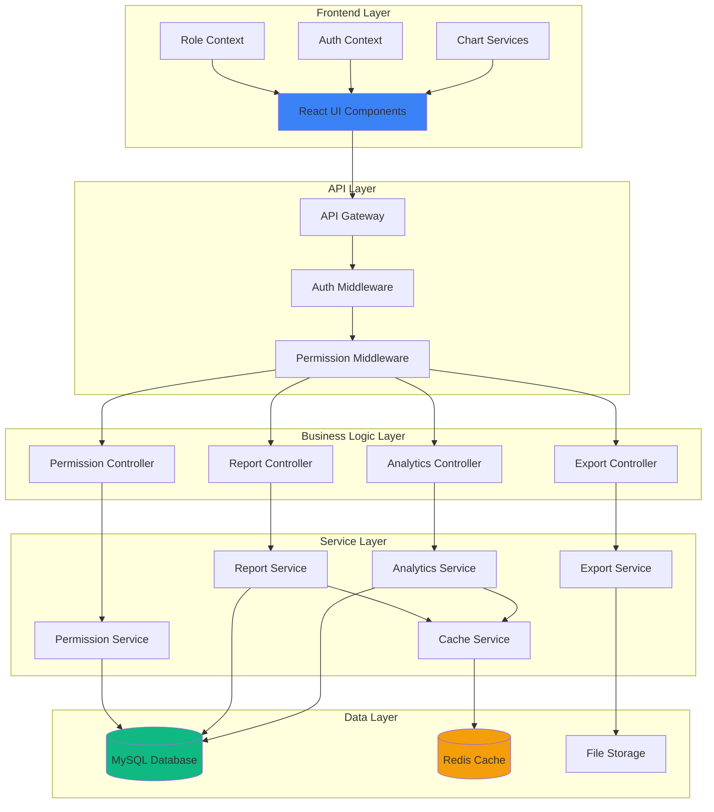
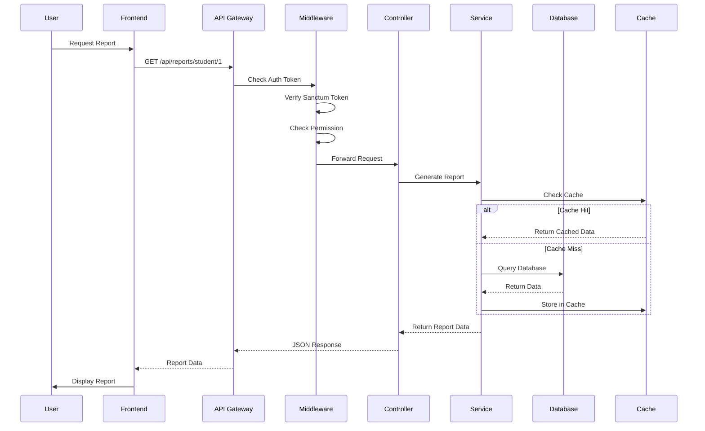
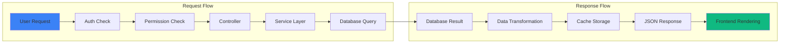
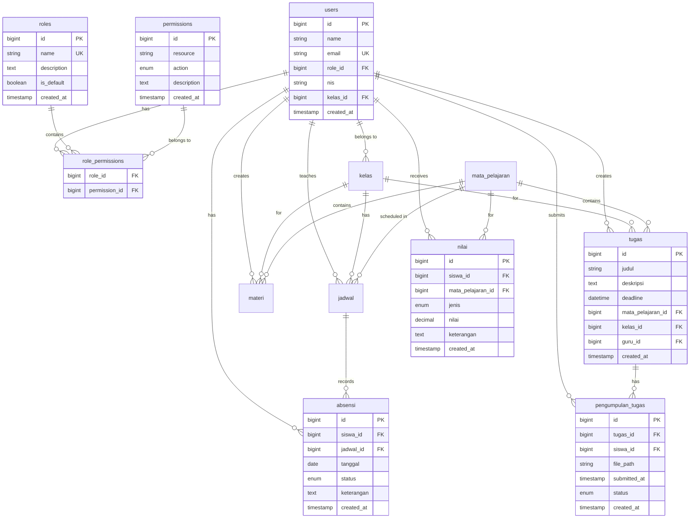

# Design Document: Reporting and Permissions Feature

## Overview

This design document specifies the technical implementation for the Reporting and Permissions feature of the SMKN 2 Kuningan Learning Management System (LMS). The feature extends the existing Laravel + React application with:

1. **Role-Based Access Control (RBAC)**: A flexible permission system supporting Admin, Guru, and Siswa roles with custom role creation
2. **Student Reporting**: Individual student reports with academic progress, grades, attendance, and assignment submissions
3. **Teacher Reporting**: Class performance reports, assignment statistics, and workload analytics
4. **Analytics Dashboard**: System-wide statistics with visual charts for performance, attendance, and completion metrics
5. **Export Functionality**: PDF and Excel export capabilities for all reports and analytics

### Design Goals

- **Security**: Granular permission checking at both API and UI levels
- **Performance**: Optimized queries with caching for reports and analytics
- **Scalability**: Database design supporting thousands of users and records
- **Usability**: Intuitive UI with role-based rendering and responsive design
- **Maintainability**: Clean separation of concerns with service layers and reusable components

### Technology Stack

**Backend:**
- Laravel 11.x with PHP 8.1+
- Laravel Sanctum for authentication
- MySQL 8.0+ for data storage
- DomPDF for PDF generation
- PhpSpreadsheet for Excel generation

**Frontend:**
- React 18 with Vite
- Tailwind CSS for styling
- Recharts for data visualization
- Axios for API communication
- React Router v6 for navigation

## Architecture

### High-Level System Architecture



### Component Interaction Flow



### Data Flow Architecture



## Components and Interfaces

### Backend Components

#### 1. Permission System Components

**PermissionController**
```php
class PermissionController extends Controller
{
    public function getRoles(): JsonResponse
    public function createRole(CreateRoleRequest $request): JsonResponse
    public function updateRole(int $id, UpdateRoleRequest $request): JsonResponse
    public function deleteRole(int $id): JsonResponse
    public function getPermissions(): JsonResponse
    public function assignRole(int $userId, AssignRoleRequest $request): JsonResponse
}
```

**PermissionService**
```php
class PermissionService
{
    public function getAllRoles(): Collection
    public function createCustomRole(array $data): Role
    public function updateRole(int $id, array $data): Role
    public function deleteCustomRole(int $id): bool
    public function getAllPermissions(): Collection
    public function assignRoleToUser(int $userId, int $roleId): User
    public function checkPermission(User $user, string $resource, string $action): bool
    public function cacheUserPermissions(User $user): void
}
```

**CheckPermission Middleware**
```php
class CheckPermission
{
    public function handle(Request $request, Closure $next, string $resource, string $action): Response
    {
        // Check if user has required permission
        // Return 403 if unauthorized
        // Cache permission checks
    }
}
```

#### 2. Report Generation Components

**ReportController**
```php
class ReportController extends Controller
{
    public function getStudentReport(int $studentId, Request $request): JsonResponse
    public function exportStudentReport(int $studentId, Request $request): Response
    public function getClassReport(int $classId, Request $request): JsonResponse
    public function exportClassReport(int $classId, Request $request): Response
    public function getAssignmentStatistics(Request $request): JsonResponse
}
```

**ReportService**
```php
class ReportService
{
    public function generateStudentReport(int $studentId, ?string $startDate, ?string $endDate): array
    public function generateClassReport(int $classId, ?string $startDate, ?string $endDate): array
    public function getAssignmentStatistics(int $teacherId, ?int $classId, ?int $subjectId): array
    public function calculateAverageGrade(int $studentId): float
    public function calculateAttendanceRate(int $studentId, ?string $startDate, ?string $endDate): float
    public function getSubmissionHistory(int $studentId): Collection
}
```

#### 3. Analytics Components

**AnalyticsController**
```php
class AnalyticsController extends Controller
{
    public function getSystemStats(): JsonResponse
    public function getPerformanceAnalytics(Request $request): JsonResponse
    public function getAttendanceAnalytics(Request $request): JsonResponse
    public function getAssignmentAnalytics(Request $request): JsonResponse
    public function getTeacherWorkload(): JsonResponse
}
```

**AnalyticsService**
```php
class AnalyticsService
{
    public function getSystemStatistics(): array
    public function getPerformanceMetrics(?int $classId, ?int $subjectId, ?string $startDate, ?string $endDate): array
    public function getAttendanceTrends(?int $classId, ?string $startDate, ?string $endDate): array
    public function getAssignmentCompletionRates(?int $classId, ?int $subjectId): array
    public function getTeacherWorkloadDistribution(): array
    public function calculatePassRate(Collection $grades): float
    public function identifyLowPerformingSubjects(): Collection
}
```

#### 4. Export Components

**ExportService**
```php
class ExportService
{
    public function exportToPdf(array $data, string $template): string
    public function exportToExcel(array $data, string $type): string
    public function generateStudentReportPdf(array $reportData): string
    public function generateClassReportPdf(array $reportData): string
    public function generateAnalyticsPdf(array $analyticsData): string
    public function generateStudentReportExcel(array $reportData): string
    public function generateClassReportExcel(array $reportData): string
}
```

### Frontend Components

#### 1. Permission Management Components

**RoleManagement.jsx**
```jsx
const RoleManagement = () => {
  // List all roles
  // Create/Edit/Delete custom roles
  // Assign permissions to roles
  // Display user count per role
}
```

**RoleForm.jsx**
```jsx
const RoleForm = ({ role, onSave, onCancel }) => {
  // Form for creating/editing roles
  // Permission selection with checkboxes
  // Grouped by resource type
  // Validation
}
```

**PermissionMatrix.jsx**
```jsx
const PermissionMatrix = ({ roleId, permissions, onChange }) => {
  // Grid display of permissions
  // Grouped by resource
  // Checkboxes for CRUD actions
}
```

#### 2. Report Components

**StudentReportView.jsx**
```jsx
const StudentReportView = () => {
  // Student selector
  // Date range filter
  // Display report sections:
  //   - Student info
  //   - Grades table
  //   - Attendance summary
  //   - Assignment submissions
  // Export buttons (PDF/Excel)
}
```

**ClassReportView.jsx**
```jsx
const ClassReportView = () => {
  // Class selector
  // Date range filter
  // Display report sections:
  //   - Class statistics
  //   - Grade distribution
  //   - Top/bottom performers
  //   - Assignment completion
  // Export buttons
}
```

**AssignmentStatistics.jsx**
```jsx
const AssignmentStatistics = () => {
  // Filter by class/subject
  // Display statistics:
  //   - Total assignments
  //   - Submission rates
  //   - Late submissions
  //   - Pending list
}
```

#### 3. Analytics Dashboard Components

**AnalyticsDashboard.jsx**
```jsx
const AnalyticsDashboard = () => {
  // Grid layout for stat cards
  // Chart sections
  // Filter controls
  // Export button
  // Real-time updates
}
```

**StatCard.jsx**
```jsx
const StatCard = ({ title, value, icon, color, trend }) => {
  // Display single statistic
  // Icon and color coding
  // Optional trend indicator
}
```

**ChartRenderer.jsx**
```jsx
const ChartRenderer = ({ type, data, options }) => {
  // Render different chart types:
  //   - Line charts (trends)
  //   - Bar charts (comparisons)
  //   - Pie charts (distributions)
  // Responsive sizing
  // Hover tooltips
}
```

**DateRangeFilter.jsx**
```jsx
const DateRangeFilter = ({ onApply, presets }) => {
  // Start/end date inputs
  // Preset buttons (Last 7 days, etc.)
  // Validation
  // Session persistence
}
```

#### 4. Shared Components

**ExportButton.jsx**
```jsx
const ExportButton = ({ onExport, formats }) => {
  // Dropdown for format selection
  // Loading state during export
  // Trigger file download
}
```

**LoadingSpinner.jsx**
```jsx
const LoadingSpinner = ({ size, message }) => {
  // Animated spinner
  // Optional message
  // Different sizes
}
```

**ErrorMessage.jsx**
```jsx
const ErrorMessage = ({ message, onRetry }) => {
  // Display error
  // Optional retry button
  // Dismissible
}
```


## Data Models

### Database Schema

#### New Tables

**1. roles Table**
```sql
CREATE TABLE roles (
    id BIGINT UNSIGNED AUTO_INCREMENT PRIMARY KEY,
    name VARCHAR(255) NOT NULL UNIQUE,
    description TEXT,
    is_default BOOLEAN DEFAULT FALSE,
    created_at TIMESTAMP NULL,
    updated_at TIMESTAMP NULL,
    INDEX idx_name (name),
    INDEX idx_is_default (is_default)
) ENGINE=InnoDB DEFAULT CHARSET=utf8mb4 COLLATE=utf8mb4_unicode_ci;
```

**2. permissions Table**
```sql
CREATE TABLE permissions (
    id BIGINT UNSIGNED AUTO_INCREMENT PRIMARY KEY,
    resource VARCHAR(255) NOT NULL,
    action ENUM('create', 'read', 'update', 'delete') NOT NULL,
    description TEXT,
    created_at TIMESTAMP NULL,
    updated_at TIMESTAMP NULL,
    UNIQUE KEY unique_permission (resource, action),
    INDEX idx_resource (resource)
) ENGINE=InnoDB DEFAULT CHARSET=utf8mb4 COLLATE=utf8mb4_unicode_ci;
```

**3. role_permissions Table (Pivot)**
```sql
CREATE TABLE role_permissions (
    role_id BIGINT UNSIGNED NOT NULL,
    permission_id BIGINT UNSIGNED NOT NULL,
    PRIMARY KEY (role_id, permission_id),
    FOREIGN KEY (role_id) REFERENCES roles(id) ON DELETE CASCADE,
    FOREIGN KEY (permission_id) REFERENCES permissions(id) ON DELETE CASCADE,
    INDEX idx_role_id (role_id),
    INDEX idx_permission_id (permission_id)
) ENGINE=InnoDB DEFAULT CHARSET=utf8mb4 COLLATE=utf8mb4_unicode_ci;
```

#### Modified Tables

**users Table (Add role_id)**
```sql
ALTER TABLE users 
ADD COLUMN role_id BIGINT UNSIGNED NULL AFTER email,
ADD COLUMN nis VARCHAR(50) NULL AFTER role_id,
ADD COLUMN kelas_id BIGINT UNSIGNED NULL AFTER nis,
ADD FOREIGN KEY (role_id) REFERENCES roles(id) ON DELETE SET NULL,
ADD INDEX idx_role_id (role_id),
ADD INDEX idx_nis (nis);
```

#### Supporting Tables (Assumed to exist from Phase 2-6)

**kelas Table**
```sql
CREATE TABLE kelas (
    id BIGINT UNSIGNED AUTO_INCREMENT PRIMARY KEY,
    nama VARCHAR(255) NOT NULL,
    jurusan_id BIGINT UNSIGNED NOT NULL,
    tingkat INT NOT NULL,
    created_at TIMESTAMP NULL,
    updated_at TIMESTAMP NULL,
    FOREIGN KEY (jurusan_id) REFERENCES jurusan(id) ON DELETE CASCADE
) ENGINE=InnoDB;
```

**mata_pelajaran Table**
```sql
CREATE TABLE mata_pelajaran (
    id BIGINT UNSIGNED AUTO_INCREMENT PRIMARY KEY,
    nama VARCHAR(255) NOT NULL,
    kode VARCHAR(50) NOT NULL UNIQUE,
    created_at TIMESTAMP NULL,
    updated_at TIMESTAMP NULL
) ENGINE=InnoDB;
```

**jadwal Table**
```sql
CREATE TABLE jadwal (
    id BIGINT UNSIGNED AUTO_INCREMENT PRIMARY KEY,
    kelas_id BIGINT UNSIGNED NOT NULL,
    mata_pelajaran_id BIGINT UNSIGNED NOT NULL,
    guru_id BIGINT UNSIGNED NOT NULL,
    hari ENUM('Senin', 'Selasa', 'Rabu', 'Kamis', 'Jumat', 'Sabtu') NOT NULL,
    jam_mulai TIME NOT NULL,
    jam_selesai TIME NOT NULL,
    created_at TIMESTAMP NULL,
    updated_at TIMESTAMP NULL,
    FOREIGN KEY (kelas_id) REFERENCES kelas(id) ON DELETE CASCADE,
    FOREIGN KEY (mata_pelajaran_id) REFERENCES mata_pelajaran(id) ON DELETE CASCADE,
    FOREIGN KEY (guru_id) REFERENCES users(id) ON DELETE CASCADE,
    INDEX idx_kelas_id (kelas_id),
    INDEX idx_guru_id (guru_id)
) ENGINE=InnoDB;
```

**materi Table**
```sql
CREATE TABLE materi (
    id BIGINT UNSIGNED AUTO_INCREMENT PRIMARY KEY,
    judul VARCHAR(255) NOT NULL,
    deskripsi TEXT,
    file_path VARCHAR(255),
    mata_pelajaran_id BIGINT UNSIGNED NOT NULL,
    kelas_id BIGINT UNSIGNED NOT NULL,
    guru_id BIGINT UNSIGNED NOT NULL,
    created_at TIMESTAMP NULL,
    updated_at TIMESTAMP NULL,
    FOREIGN KEY (mata_pelajaran_id) REFERENCES mata_pelajaran(id) ON DELETE CASCADE,
    FOREIGN KEY (kelas_id) REFERENCES kelas(id) ON DELETE CASCADE,
    FOREIGN KEY (guru_id) REFERENCES users(id) ON DELETE CASCADE,
    INDEX idx_mata_pelajaran_id (mata_pelajaran_id),
    INDEX idx_kelas_id (kelas_id),
    INDEX idx_guru_id (guru_id)
) ENGINE=InnoDB;
```

**tugas Table**
```sql
CREATE TABLE tugas (
    id BIGINT UNSIGNED AUTO_INCREMENT PRIMARY KEY,
    judul VARCHAR(255) NOT NULL,
    deskripsi TEXT,
    deadline DATETIME NOT NULL,
    mata_pelajaran_id BIGINT UNSIGNED NOT NULL,
    kelas_id BIGINT UNSIGNED NOT NULL,
    guru_id BIGINT UNSIGNED NOT NULL,
    created_at TIMESTAMP NULL,
    updated_at TIMESTAMP NULL,
    FOREIGN KEY (mata_pelajaran_id) REFERENCES mata_pelajaran(id) ON DELETE CASCADE,
    FOREIGN KEY (kelas_id) REFERENCES kelas(id) ON DELETE CASCADE,
    FOREIGN KEY (guru_id) REFERENCES users(id) ON DELETE CASCADE,
    INDEX idx_deadline (deadline),
    INDEX idx_mata_pelajaran_id (mata_pelajaran_id),
    INDEX idx_kelas_id (kelas_id)
) ENGINE=InnoDB;
```

**pengumpulan_tugas Table**
```sql
CREATE TABLE pengumpulan_tugas (
    id BIGINT UNSIGNED AUTO_INCREMENT PRIMARY KEY,
    tugas_id BIGINT UNSIGNED NOT NULL,
    siswa_id BIGINT UNSIGNED NOT NULL,
    file_path VARCHAR(255),
    catatan TEXT,
    submitted_at TIMESTAMP NULL,
    status ENUM('submitted', 'late', 'pending') DEFAULT 'pending',
    created_at TIMESTAMP NULL,
    updated_at TIMESTAMP NULL,
    FOREIGN KEY (tugas_id) REFERENCES tugas(id) ON DELETE CASCADE,
    FOREIGN KEY (siswa_id) REFERENCES users(id) ON DELETE CASCADE,
    INDEX idx_tugas_id (tugas_id),
    INDEX idx_siswa_id (siswa_id),
    INDEX idx_status (status),
    INDEX idx_submitted_at (submitted_at)
) ENGINE=InnoDB;
```

**nilai Table**
```sql
CREATE TABLE nilai (
    id BIGINT UNSIGNED AUTO_INCREMENT PRIMARY KEY,
    siswa_id BIGINT UNSIGNED NOT NULL,
    mata_pelajaran_id BIGINT UNSIGNED NOT NULL,
    jenis ENUM('tugas', 'uts', 'uas', 'quiz') NOT NULL,
    nilai DECIMAL(5,2) NOT NULL,
    keterangan TEXT,
    created_at TIMESTAMP NULL,
    updated_at TIMESTAMP NULL,
    FOREIGN KEY (siswa_id) REFERENCES users(id) ON DELETE CASCADE,
    FOREIGN KEY (mata_pelajaran_id) REFERENCES mata_pelajaran(id) ON DELETE CASCADE,
    INDEX idx_siswa_id (siswa_id),
    INDEX idx_mata_pelajaran_id (mata_pelajaran_id),
    INDEX idx_jenis (jenis)
) ENGINE=InnoDB;
```

**absensi Table**
```sql
CREATE TABLE absensi (
    id BIGINT UNSIGNED AUTO_INCREMENT PRIMARY KEY,
    siswa_id BIGINT UNSIGNED NOT NULL,
    jadwal_id BIGINT UNSIGNED NOT NULL,
    tanggal DATE NOT NULL,
    status ENUM('hadir', 'sakit', 'izin', 'alpha') NOT NULL,
    keterangan TEXT,
    created_at TIMESTAMP NULL,
    updated_at TIMESTAMP NULL,
    FOREIGN KEY (siswa_id) REFERENCES users(id) ON DELETE CASCADE,
    FOREIGN KEY (jadwal_id) REFERENCES jadwal(id) ON DELETE CASCADE,
    UNIQUE KEY unique_attendance (siswa_id, jadwal_id, tanggal),
    INDEX idx_siswa_id (siswa_id),
    INDEX idx_tanggal (tanggal),
    INDEX idx_status (status)
) ENGINE=InnoDB;
```

### Entity Relationship Diagram



### Laravel Eloquent Models

**Role Model**
```php
namespace App\Models;

use Illuminate\Database\Eloquent\Model;
use Illuminate\Database\Eloquent\Relations\BelongsToMany;
use Illuminate\Database\Eloquent\Relations\HasMany;

class Role extends Model
{
    protected $fillable = ['name', 'description', 'is_default'];
    
    protected $casts = [
        'is_default' => 'boolean',
    ];
    
    public function permissions(): BelongsToMany
    {
        return $this->belongsToMany(Permission::class, 'role_permissions');
    }
    
    public function users(): HasMany
    {
        return $this->hasMany(User::class);
    }
    
    public function hasPermission(string $resource, string $action): bool
    {
        return $this->permissions()
            ->where('resource', $resource)
            ->where('action', $action)
            ->exists();
    }
}
```

**Permission Model**
```php
namespace App\Models;

use Illuminate\Database\Eloquent\Model;
use Illuminate\Database\Eloquent\Relations\BelongsToMany;

class Permission extends Model
{
    protected $fillable = ['resource', 'action', 'description'];
    
    public function roles(): BelongsToMany
    {
        return $this->belongsToMany(Role::class, 'role_permissions');
    }
}
```

**User Model (Extended)**
```php
namespace App\Models;

use Illuminate\Foundation\Auth\User as Authenticatable;
use Laravel\Sanctum\HasApiTokens;
use Illuminate\Database\Eloquent\Relations\BelongsTo;
use Illuminate\Database\Eloquent\Relations\HasMany;

class User extends Authenticatable
{
    use HasApiTokens;
    
    protected $fillable = [
        'name', 'email', 'password', 'role_id', 'nis', 'kelas_id'
    ];
    
    protected $hidden = ['password', 'remember_token'];
    
    public function role(): BelongsTo
    {
        return $this->belongsTo(Role::class);
    }
    
    public function kelas(): BelongsTo
    {
        return $this->belongsTo(Kelas::class);
    }
    
    public function hasPermission(string $resource, string $action): bool
    {
        return $this->role?->hasPermission($resource, $action) ?? false;
    }
    
    public function isAdmin(): bool
    {
        return $this->role?->name === 'Admin';
    }
    
    public function isGuru(): bool
    {
        return $this->role?->name === 'Guru';
    }
    
    public function isSiswa(): bool
    {
        return $this->role?->name === 'Siswa';
    }
    
    // Relationships for reporting
    public function nilai(): HasMany
    {
        return $this->hasMany(Nilai::class, 'siswa_id');
    }
    
    public function absensi(): HasMany
    {
        return $this->hasMany(Absensi::class, 'siswa_id');
    }
    
    public function pengumpulanTugas(): HasMany
    {
        return $this->hasMany(PengumpulanTugas::class, 'siswa_id');
    }
    
    public function materiCreated(): HasMany
    {
        return $this->hasMany(Materi::class, 'guru_id');
    }
    
    public function tugasCreated(): HasMany
    {
        return $this->hasMany(Tugas::class, 'guru_id');
    }
}
```

**Nilai Model**
```php
namespace App\Models;

use Illuminate\Database\Eloquent\Model;
use Illuminate\Database\Eloquent\Relations\BelongsTo;

class Nilai extends Model
{
    protected $table = 'nilai';
    
    protected $fillable = [
        'siswa_id', 'mata_pelajaran_id', 'jenis', 'nilai', 'keterangan'
    ];
    
    protected $casts = [
        'nilai' => 'decimal:2',
    ];
    
    public function siswa(): BelongsTo
    {
        return $this->belongsTo(User::class, 'siswa_id');
    }
    
    public function mataPelajaran(): BelongsTo
    {
        return $this->belongsTo(MataPelajaran::class);
    }
}
```

**Absensi Model**
```php
namespace App\Models;

use Illuminate\Database\Eloquent\Model;
use Illuminate\Database\Eloquent\Relations\BelongsTo;

class Absensi extends Model
{
    protected $table = 'absensi';
    
    protected $fillable = [
        'siswa_id', 'jadwal_id', 'tanggal', 'status', 'keterangan'
    ];
    
    protected $casts = [
        'tanggal' => 'date',
    ];
    
    public function siswa(): BelongsTo
    {
        return $this->belongsTo(User::class, 'siswa_id');
    }
    
    public function jadwal(): BelongsTo
    {
        return $this->belongsTo(Jadwal::class);
    }
}
```

### Database Indexes for Performance

**Critical Indexes:**
1. `users.role_id` - For permission checks
2. `users.nis` - For student lookups
3. `nilai.siswa_id` - For grade queries
4. `absensi.siswa_id, absensi.tanggal` - For attendance reports
5. `pengumpulan_tugas.tugas_id, pengumpulan_tugas.status` - For submission statistics
6. `tugas.deadline` - For deadline queries
7. `role_permissions.role_id, role_permissions.permission_id` - For permission lookups

**Composite Indexes:**
```sql
CREATE INDEX idx_nilai_student_subject ON nilai(siswa_id, mata_pelajaran_id);
CREATE INDEX idx_absensi_student_date ON absensi(siswa_id, tanggal);
CREATE INDEX idx_tugas_class_subject ON tugas(kelas_id, mata_pelajaran_id);
CREATE INDEX idx_pengumpulan_status_date ON pengumpulan_tugas(status, submitted_at);
```


## Backend API Design

### API Endpoint Structure

All endpoints follow RESTful conventions and require authentication via Laravel Sanctum tokens.

**Base URL:** `http://localhost:8000/api`

**Authentication Header:**
```
Authorization: Bearer {token}
```

### 1. Role and Permission Endpoints

#### GET /api/roles
Get all roles with their permissions.

**Authorization:** Admin only

**Response:**
```json
{
  "success": true,
  "data": [
    {
      "id": 1,
      "name": "Admin",
      "description": "Full system access",
      "is_default": true,
      "user_count": 5,
      "permissions": [
        {
          "id": 1,
          "resource": "users",
          "action": "create",
          "description": "Create new users"
        }
      ]
    }
  ]
}
```

#### POST /api/roles
Create a new custom role.

**Authorization:** Admin only

**Request Body:**
```json
{
  "name": "Koordinator",
  "description": "Coordinator role with limited admin access",
  "permission_ids": [1, 2, 3, 5, 8]
}
```

**Response:**
```json
{
  "success": true,
  "message": "Role created successfully",
  "data": {
    "id": 4,
    "name": "Koordinator",
    "description": "Coordinator role with limited admin access",
    "is_default": false,
    "permissions": [...]
  }
}
```

#### PUT /api/roles/{id}
Update an existing role.

**Authorization:** Admin only

**Request Body:**
```json
{
  "name": "Koordinator",
  "description": "Updated description",
  "permission_ids": [1, 2, 3, 5, 8, 10]
}
```

**Response:**
```json
{
  "success": true,
  "message": "Role updated successfully",
  "data": {...}
}
```

#### DELETE /api/roles/{id}
Delete a custom role (cannot delete default roles).

**Authorization:** Admin only

**Response:**
```json
{
  "success": true,
  "message": "Role deleted successfully. Affected users reassigned to default role."
}
```

#### GET /api/permissions
Get all available permissions grouped by resource.

**Authorization:** Admin only

**Response:**
```json
{
  "success": true,
  "data": {
    "users": [
      {"id": 1, "action": "create", "description": "Create users"},
      {"id": 2, "action": "read", "description": "View users"},
      {"id": 3, "action": "update", "description": "Update users"},
      {"id": 4, "action": "delete", "description": "Delete users"}
    ],
    "kelas": [...],
    "mata_pelajaran": [...]
  }
}
```

#### POST /api/users/{id}/assign-role
Assign a role to a user.

**Authorization:** Admin only

**Request Body:**
```json
{
  "role_id": 2
}
```

**Response:**
```json
{
  "success": true,
  "message": "Role assigned successfully",
  "data": {
    "id": 10,
    "name": "John Doe",
    "email": "john@example.com",
    "role": {
      "id": 2,
      "name": "Guru"
    }
  }
}
```

### 2. Student Report Endpoints

#### GET /api/reports/student/{id}
Get comprehensive student report.

**Authorization:** Guru (own students only), Admin

**Query Parameters:**
- `start_date` (optional): YYYY-MM-DD format
- `end_date` (optional): YYYY-MM-DD format

**Example:** `/api/reports/student/15?start_date=2024-01-01&end_date=2024-06-30`

**Response:**
```json
{
  "success": true,
  "data": {
    "student": {
      "id": 15,
      "name": "Ahmad Fauzi",
      "nis": "2024001",
      "kelas": {
        "id": 3,
        "nama": "XII RPL 1"
      }
    },
    "period": {
      "start_date": "2024-01-01",
      "end_date": "2024-06-30"
    },
    "grades": [
      {
        "mata_pelajaran": "Matematika",
        "tugas": 85,
        "uts": 80,
        "uas": 90,
        "average": 85
      }
    ],
    "grade_summary": {
      "average": 85.5,
      "highest": 95,
      "lowest": 70
    },
    "attendance": {
      "total_days": 120,
      "hadir": 110,
      "sakit": 5,
      "izin": 3,
      "alpha": 2,
      "attendance_rate": 91.67
    },
    "assignments": {
      "total": 30,
      "submitted": 28,
      "late": 2,
      "pending": 0,
      "completion_rate": 93.33
    },
    "submission_history": [
      {
        "tugas_id": 5,
        "judul": "Tugas Matematika 1",
        "deadline": "2024-02-15 23:59:00",
        "submitted_at": "2024-02-14 10:30:00",
        "status": "submitted"
      }
    ]
  }
}
```

#### GET /api/reports/student/{id}/export
Export student report to PDF or Excel.

**Authorization:** Guru (own students only), Admin

**Query Parameters:**
- `format`: "pdf" or "excel" (required)
- `start_date` (optional): YYYY-MM-DD
- `end_date` (optional): YYYY-MM-DD

**Example:** `/api/reports/student/15/export?format=pdf&start_date=2024-01-01`

**Response:** File download (Content-Type: application/pdf or application/vnd.openxmlformats-officedocument.spreadsheetml.sheet)

### 3. Teacher Report Endpoints

#### GET /api/reports/class/{id}
Get class performance report.

**Authorization:** Guru (own classes only), Admin

**Query Parameters:**
- `start_date` (optional): YYYY-MM-DD
- `end_date` (optional): YYYY-MM-DD

**Response:**
```json
{
  "success": true,
  "data": {
    "class": {
      "id": 3,
      "nama": "XII RPL 1",
      "total_students": 30
    },
    "period": {
      "start_date": "2024-01-01",
      "end_date": "2024-06-30"
    },
    "performance": {
      "average_grade": 82.5,
      "pass_rate": 90.0,
      "fail_rate": 10.0,
      "grade_distribution": {
        "90-100": 8,
        "80-89": 12,
        "70-79": 7,
        "60-69": 2,
        "0-59": 1
      }
    },
    "attendance": {
      "class_attendance_rate": 88.5,
      "lowest_attendance_students": [
        {"id": 15, "name": "Ahmad", "rate": 75.0}
      ]
    },
    "assignments": {
      "completion_rate": 85.5,
      "late_submission_rate": 12.3
    },
    "top_performers": [
      {"id": 20, "name": "Siti", "average": 95.0}
    ],
    "bottom_performers": [
      {"id": 18, "name": "Budi", "average": 65.0}
    ]
  }
}
```

#### GET /api/reports/teacher/assignments
Get assignment statistics for a teacher.

**Authorization:** Guru (own data), Admin

**Query Parameters:**
- `class_id` (optional): Filter by class
- `subject_id` (optional): Filter by subject

**Response:**
```json
{
  "success": true,
  "data": {
    "total_assignments": 45,
    "assignments": [
      {
        "id": 10,
        "judul": "Tugas Matematika 1",
        "kelas": "XII RPL 1",
        "mata_pelajaran": "Matematika",
        "deadline": "2024-02-15 23:59:00",
        "total_students": 30,
        "submitted": 28,
        "pending": 2,
        "late": 3,
        "submission_rate": 93.33
      }
    ],
    "summary": {
      "average_submission_rate": 88.5,
      "total_late_submissions": 15,
      "students_with_pending": [
        {"id": 15, "name": "Ahmad", "pending_count": 3}
      ]
    }
  }
}
```

#### GET /api/reports/class/{id}/export
Export class report to PDF or Excel.

**Authorization:** Guru (own classes only), Admin

**Query Parameters:**
- `format`: "pdf" or "excel" (required)
- `start_date` (optional): YYYY-MM-DD
- `end_date` (optional): YYYY-MM-DD

**Response:** File download

### 4. Analytics Dashboard Endpoints

#### GET /api/analytics/system-stats
Get overall system statistics.

**Authorization:** Admin

**Response:**
```json
{
  "success": true,
  "data": {
    "users": {
      "total": 350,
      "by_role": {
        "Admin": 5,
        "Guru": 45,
        "Siswa": 300
      }
    },
    "classes": 15,
    "subjects": 12,
    "assignments": 450,
    "materials": 320,
    "active_users_today": 180
  }
}
```

#### GET /api/analytics/performance
Get student performance analytics.

**Authorization:** Guru (own classes), Admin

**Query Parameters:**
- `class_id` (optional): Filter by class
- `subject_id` (optional): Filter by subject
- `start_date` (optional): YYYY-MM-DD
- `end_date` (optional): YYYY-MM-DD

**Response:**
```json
{
  "success": true,
  "data": {
    "overall": {
      "average_grade": 82.5,
      "pass_rate": 88.5,
      "fail_rate": 11.5
    },
    "grade_distribution": [
      {"range": "90-100", "count": 45},
      {"range": "80-89", "count": 120},
      {"range": "70-79", "count": 90},
      {"range": "60-69", "count": 30},
      {"range": "0-59", "count": 15}
    ],
    "trends": [
      {"month": "2024-01", "average": 80.5},
      {"month": "2024-02", "average": 82.0},
      {"month": "2024-03", "average": 83.5}
    ],
    "low_performing_subjects": [
      {"id": 5, "nama": "Matematika", "average": 75.0}
    ]
  }
}
```

#### GET /api/analytics/attendance
Get attendance analytics.

**Authorization:** Guru (own classes), Admin

**Query Parameters:**
- `class_id` (optional): Filter by class
- `start_date` (optional): YYYY-MM-DD
- `end_date` (optional): YYYY-MM-DD

**Response:**
```json
{
  "success": true,
  "data": {
    "overall_rate": 88.5,
    "status_distribution": {
      "hadir": 85.5,
      "sakit": 8.0,
      "izin": 4.5,
      "alpha": 2.0
    },
    "trends": [
      {"date": "2024-01-01", "rate": 87.5},
      {"date": "2024-01-02", "rate": 89.0}
    ],
    "low_attendance_classes": [
      {"id": 3, "nama": "XII RPL 1", "rate": 75.0}
    ],
    "low_attendance_students": [
      {"id": 15, "name": "Ahmad", "rate": 65.0}
    ]
  }
}
```

#### GET /api/analytics/assignments
Get assignment completion analytics.

**Authorization:** Guru (own assignments), Admin

**Query Parameters:**
- `class_id` (optional): Filter by class
- `subject_id` (optional): Filter by subject

**Response:**
```json
{
  "success": true,
  "data": {
    "overall_completion_rate": 85.5,
    "late_submission_percentage": 12.3,
    "completion_by_class": [
      {"class_id": 3, "nama": "XII RPL 1", "rate": 88.0}
    ],
    "completion_by_subject": [
      {"subject_id": 5, "nama": "Matematika", "rate": 82.0}
    ],
    "trends": [
      {"month": "2024-01", "rate": 83.0},
      {"month": "2024-02", "rate": 85.5}
    ],
    "low_completion_assignments": [
      {"id": 10, "judul": "Tugas Sulit", "rate": 60.0}
    ]
  }
}
```

#### GET /api/analytics/teacher-workload
Get teacher workload statistics.

**Authorization:** Admin

**Response:**
```json
{
  "success": true,
  "data": {
    "teachers": [
      {
        "id": 8,
        "name": "Pak Budi",
        "classes_count": 5,
        "assignments_count": 45,
        "students_count": 150,
        "materials_count": 32
      }
    ],
    "average_workload": {
      "classes": 3.5,
      "assignments": 30.0,
      "students": 105.0,
      "materials": 25.0
    },
    "high_workload_teachers": [
      {"id": 8, "name": "Pak Budi", "workload_score": 150}
    ],
    "low_workload_teachers": [
      {"id": 12, "name": "Bu Ani", "workload_score": 50}
    ]
  }
}
```

### API Error Responses

**401 Unauthorized**
```json
{
  "success": false,
  "message": "Unauthenticated"
}
```

**403 Forbidden**
```json
{
  "success": false,
  "message": "You do not have permission to access this resource"
}
```

**404 Not Found**
```json
{
  "success": false,
  "message": "Resource not found"
}
```

**422 Validation Error**
```json
{
  "success": false,
  "message": "Validation failed",
  "errors": {
    "name": ["The name field is required"],
    "start_date": ["The start date must be before end date"]
  }
}
```

**500 Server Error**
```json
{
  "success": false,
  "message": "An error occurred while processing your request",
  "error": "Detailed error message (only in development)"
}
```

### API Rate Limiting

All API endpoints are rate-limited to prevent abuse:
- **Authenticated requests:** 60 requests per minute
- **Report generation:** 10 requests per minute
- **Export endpoints:** 5 requests per minute

Rate limit headers:
```
X-RateLimit-Limit: 60
X-RateLimit-Remaining: 45
X-RateLimit-Reset: 1640995200
```

### API Middleware Stack

```php
// routes/api.php
Route::middleware(['auth:sanctum'])->group(function () {
    
    // Admin-only routes
    Route::middleware(['check.permission:roles,read'])->group(function () {
        Route::get('/roles', [PermissionController::class, 'getRoles']);
        Route::post('/roles', [PermissionController::class, 'createRole'])
            ->middleware('check.permission:roles,create');
        Route::put('/roles/{id}', [PermissionController::class, 'updateRole'])
            ->middleware('check.permission:roles,update');
        Route::delete('/roles/{id}', [PermissionController::class, 'deleteRole'])
            ->middleware('check.permission:roles,delete');
    });
    
    // Report routes
    Route::prefix('reports')->group(function () {
        Route::get('/student/{id}', [ReportController::class, 'getStudentReport'])
            ->middleware('check.permission:reports,read');
        Route::get('/student/{id}/export', [ReportController::class, 'exportStudentReport'])
            ->middleware(['check.permission:reports,read', 'throttle:5,1']);
        Route::get('/class/{id}', [ReportController::class, 'getClassReport'])
            ->middleware('check.permission:reports,read');
        Route::get('/class/{id}/export', [ReportController::class, 'exportClassReport'])
            ->middleware(['check.permission:reports,read', 'throttle:5,1']);
    });
    
    // Analytics routes
    Route::prefix('analytics')->group(function () {
        Route::get('/system-stats', [AnalyticsController::class, 'getSystemStats'])
            ->middleware('check.permission:analytics,read');
        Route::get('/performance', [AnalyticsController::class, 'getPerformanceAnalytics'])
            ->middleware('check.permission:analytics,read');
        Route::get('/attendance', [AnalyticsController::class, 'getAttendanceAnalytics'])
            ->middleware('check.permission:analytics,read');
        Route::get('/assignments', [AnalyticsController::class, 'getAssignmentAnalytics'])
            ->middleware('check.permission:analytics,read');
        Route::get('/teacher-workload', [AnalyticsController::class, 'getTeacherWorkload'])
            ->middleware('check.permission:analytics,read');
    });
});
```


## Permission System Implementation

### Permission Checking Middleware

**CheckPermission Middleware**
```php
namespace App\Http\Middleware;

use Closure;
use Illuminate\Http\Request;
use Illuminate\Support\Facades\Cache;

class CheckPermission
{
    public function handle(Request $request, Closure $next, string $resource, string $action)
    {
        $user = $request->user();
        
        if (!$user) {
            return response()->json([
                'success' => false,
                'message' => 'Unauthenticated'
            ], 401);
        }
        
        // Check cached permissions first
        $cacheKey = "user_permissions_{$user->id}";
        $hasPermission = Cache::remember($cacheKey, 3600, function () use ($user, $resource, $action) {
            return $user->hasPermission($resource, $action);
        });
        
        if (!$hasPermission) {
            // Log permission denial for security auditing
            \Log::warning('Permission denied', [
                'user_id' => $user->id,
                'resource' => $resource,
                'action' => $action,
                'ip' => $request->ip()
            ]);
            
            return response()->json([
                'success' => false,
                'message' => 'You do not have permission to access this resource'
            ], 403);
        }
        
        return $next($request);
    }
}
```

### Permission Caching Strategy

**Cache Structure:**
```php
// Cache key format: user_permissions_{user_id}
// Cache duration: 1 hour (3600 seconds)
// Cache driver: Redis (recommended) or file

// Example cached data structure:
[
    'users' => ['create', 'read', 'update', 'delete'],
    'kelas' => ['read'],
    'reports' => ['read'],
    'analytics' => ['read']
]
```

**Cache Invalidation:**
```php
namespace App\Services;

class PermissionService
{
    public function updateRole(int $roleId, array $data): Role
    {
        $role = Role::findOrFail($roleId);
        $role->update($data);
        
        // Sync permissions
        if (isset($data['permission_ids'])) {
            $role->permissions()->sync($data['permission_ids']);
        }
        
        // Invalidate cache for all users with this role
        $this->invalidateRoleCache($roleId);
        
        return $role->load('permissions');
    }
    
    private function invalidateRoleCache(int $roleId): void
    {
        $userIds = User::where('role_id', $roleId)->pluck('id');
        
        foreach ($userIds as $userId) {
            Cache::forget("user_permissions_{$userId}");
        }
    }
}
```

### Role-Based UI Rendering

**Frontend Permission Context**
```jsx
// contexts/PermissionContext.jsx
import { createContext, useContext, useState, useEffect } from 'react';
import { authService } from '../services/authService';

const PermissionContext = createContext();

export const PermissionProvider = ({ children }) => {
  const [permissions, setPermissions] = useState({});
  const [loading, setLoading] = useState(true);
  
  useEffect(() => {
    loadPermissions();
  }, []);
  
  const loadPermissions = async () => {
    try {
      const user = await authService.getCurrentUser();
      if (user && user.role) {
        // Transform permissions into easy-to-check format
        const permMap = {};
        user.role.permissions.forEach(perm => {
          if (!permMap[perm.resource]) {
            permMap[perm.resource] = [];
          }
          permMap[perm.resource].push(perm.action);
        });
        setPermissions(permMap);
      }
    } catch (error) {
      console.error('Failed to load permissions:', error);
    } finally {
      setLoading(false);
    }
  };
  
  const hasPermission = (resource, action) => {
    return permissions[resource]?.includes(action) || false;
  };
  
  const canCreate = (resource) => hasPermission(resource, 'create');
  const canRead = (resource) => hasPermission(resource, 'read');
  const canUpdate = (resource) => hasPermission(resource, 'update');
  const canDelete = (resource) => hasPermission(resource, 'delete');
  
  return (
    <PermissionContext.Provider value={{
      permissions,
      hasPermission,
      canCreate,
      canRead,
      canUpdate,
      canDelete,
      loading
    }}>
      {children}
    </PermissionContext.Provider>
  );
};

export const usePermissions = () => {
  const context = useContext(PermissionContext);
  if (!context) {
    throw new Error('usePermissions must be used within PermissionProvider');
  }
  return context;
};
```

**Permission-Based Component Rendering**
```jsx
// components/common/ProtectedButton.jsx
import { usePermissions } from '../../contexts/PermissionContext';

const ProtectedButton = ({ resource, action, children, ...props }) => {
  const { hasPermission } = usePermissions();
  
  if (!hasPermission(resource, action)) {
    return null; // Hide button if no permission
  }
  
  return <button {...props}>{children}</button>;
};

// Usage example:
<ProtectedButton 
  resource="users" 
  action="create"
  onClick={handleCreateUser}
  className="btn-primary"
>
  Add User
</ProtectedButton>
```

**Conditional Menu Rendering**
```jsx
// components/layout/Sidebar.jsx
import { usePermissions } from '../../contexts/PermissionContext';

const Sidebar = () => {
  const { canRead } = usePermissions();
  
  return (
    <nav>
      {canRead('dashboard') && (
        <MenuItem to="/dashboard" icon={<HomeIcon />}>
          Dashboard
        </MenuItem>
      )}
      
      {canRead('users') && (
        <MenuItem to="/users" icon={<UsersIcon />}>
          Users
        </MenuItem>
      )}
      
      {canRead('reports') && (
        <MenuItem to="/reports" icon={<FileTextIcon />}>
          Reports
        </MenuItem>
      )}
      
      {canRead('analytics') && (
        <MenuItem to="/analytics" icon={<BarChartIcon />}>
          Analytics
        </MenuItem>
      )}
    </nav>
  );
};
```

## Report Generation System

### Report Data Aggregation

**ReportService Implementation**
```php
namespace App\Services;

use App\Models\User;
use App\Models\Nilai;
use App\Models\Absensi;
use App\Models\PengumpulanTugas;
use Illuminate\Support\Facades\DB;
use Illuminate\Support\Facades\Cache;

class ReportService
{
    public function generateStudentReport(
        int $studentId, 
        ?string $startDate = null, 
        ?string $endDate = null
    ): array {
        $cacheKey = "student_report_{$studentId}_{$startDate}_{$endDate}";
        
        return Cache::remember($cacheKey, 300, function () use ($studentId, $startDate, $endDate) {
            $student = User::with('kelas')->findOrFail($studentId);
            
            // Build date range query
            $dateQuery = function ($query) use ($startDate, $endDate) {
                if ($startDate) {
                    $query->where('created_at', '>=', $startDate);
                }
                if ($endDate) {
                    $query->where('created_at', '<=', $endDate);
                }
            };
            
            return [
                'student' => [
                    'id' => $student->id,
                    'name' => $student->name,
                    'nis' => $student->nis,
                    'kelas' => $student->kelas ? [
                        'id' => $student->kelas->id,
                        'nama' => $student->kelas->nama
                    ] : null
                ],
                'period' => [
                    'start_date' => $startDate,
                    'end_date' => $endDate
                ],
                'grades' => $this->getStudentGrades($studentId, $dateQuery),
                'grade_summary' => $this->calculateGradeSummary($studentId, $dateQuery),
                'attendance' => $this->getAttendanceSummary($studentId, $startDate, $endDate),
                'assignments' => $this->getAssignmentSummary($studentId, $dateQuery),
                'submission_history' => $this->getSubmissionHistory($studentId, $dateQuery)
            ];
        });
    }
    
    private function getStudentGrades(int $studentId, callable $dateQuery): array
    {
        return Nilai::where('siswa_id', $studentId)
            ->where($dateQuery)
            ->with('mataPelajaran')
            ->get()
            ->groupBy('mata_pelajaran_id')
            ->map(function ($grades, $subjectId) {
                $subject = $grades->first()->mataPelajaran;
                $gradesByType = $grades->groupBy('jenis');
                
                return [
                    'mata_pelajaran' => $subject->nama,
                    'tugas' => $gradesByType->get('tugas')?->avg('nilai'),
                    'uts' => $gradesByType->get('uts')?->avg('nilai'),
                    'uas' => $gradesByType->get('uas')?->avg('nilai'),
                    'average' => $grades->avg('nilai')
                ];
            })
            ->values()
            ->toArray();
    }
    
    private function calculateGradeSummary(int $studentId, callable $dateQuery): array
    {
        $grades = Nilai::where('siswa_id', $studentId)
            ->where($dateQuery)
            ->pluck('nilai');
        
        return [
            'average' => round($grades->avg(), 2),
            'highest' => $grades->max(),
            'lowest' => $grades->min()
        ];
    }
    
    private function getAttendanceSummary(int $studentId, ?string $startDate, ?string $endDate): array
    {
        $query = Absensi::where('siswa_id', $studentId);
        
        if ($startDate) {
            $query->where('tanggal', '>=', $startDate);
        }
        if ($endDate) {
            $query->where('tanggal', '<=', $endDate);
        }
        
        $attendance = $query->get();
        $total = $attendance->count();
        
        $statusCounts = $attendance->groupBy('status')->map->count();
        
        return [
            'total_days' => $total,
            'hadir' => $statusCounts->get('hadir', 0),
            'sakit' => $statusCounts->get('sakit', 0),
            'izin' => $statusCounts->get('izin', 0),
            'alpha' => $statusCounts->get('alpha', 0),
            'attendance_rate' => $total > 0 
                ? round(($statusCounts->get('hadir', 0) / $total) * 100, 2) 
                : 0
        ];
    }
    
    private function getAssignmentSummary(int $studentId, callable $dateQuery): array
    {
        $submissions = PengumpulanTugas::where('siswa_id', $studentId)
            ->where($dateQuery)
            ->get();
        
        $total = $submissions->count();
        $statusCounts = $submissions->groupBy('status')->map->count();
        
        return [
            'total' => $total,
            'submitted' => $statusCounts->get('submitted', 0),
            'late' => $statusCounts->get('late', 0),
            'pending' => $statusCounts->get('pending', 0),
            'completion_rate' => $total > 0 
                ? round((($statusCounts->get('submitted', 0) + $statusCounts->get('late', 0)) / $total) * 100, 2)
                : 0
        ];
    }
    
    private function getSubmissionHistory(int $studentId, callable $dateQuery): array
    {
        return PengumpulanTugas::where('siswa_id', $studentId)
            ->where($dateQuery)
            ->with('tugas')
            ->orderBy('submitted_at', 'desc')
            ->limit(20)
            ->get()
            ->map(function ($submission) {
                return [
                    'tugas_id' => $submission->tugas_id,
                    'judul' => $submission->tugas->judul,
                    'deadline' => $submission->tugas->deadline,
                    'submitted_at' => $submission->submitted_at,
                    'status' => $submission->status
                ];
            })
            ->toArray();
    }
    
    public function generateClassReport(
        int $classId, 
        ?string $startDate = null, 
        ?string $endDate = null
    ): array {
        $cacheKey = "class_report_{$classId}_{$startDate}_{$endDate}";
        
        return Cache::remember($cacheKey, 300, function () use ($classId, $startDate, $endDate) {
            $class = \App\Models\Kelas::findOrFail($classId);
            $students = User::where('kelas_id', $classId)->get();
            
            return [
                'class' => [
                    'id' => $class->id,
                    'nama' => $class->nama,
                    'total_students' => $students->count()
                ],
                'period' => [
                    'start_date' => $startDate,
                    'end_date' => $endDate
                ],
                'performance' => $this->getClassPerformance($students, $startDate, $endDate),
                'attendance' => $this->getClassAttendance($students, $startDate, $endDate),
                'assignments' => $this->getClassAssignments($classId, $startDate, $endDate),
                'top_performers' => $this->getTopPerformers($students, 5),
                'bottom_performers' => $this->getBottomPerformers($students, 5)
            ];
        });
    }
    
    private function getClassPerformance($students, ?string $startDate, ?string $endDate): array
    {
        $studentIds = $students->pluck('id');
        
        $query = Nilai::whereIn('siswa_id', $studentIds);
        if ($startDate) $query->where('created_at', '>=', $startDate);
        if ($endDate) $query->where('created_at', '<=', $endDate);
        
        $grades = $query->pluck('nilai');
        $averageGrade = $grades->avg();
        
        // Grade distribution
        $distribution = [
            '90-100' => $grades->filter(fn($g) => $g >= 90)->count(),
            '80-89' => $grades->filter(fn($g) => $g >= 80 && $g < 90)->count(),
            '70-79' => $grades->filter(fn($g) => $g >= 70 && $g < 80)->count(),
            '60-69' => $grades->filter(fn($g) => $g >= 60 && $g < 70)->count(),
            '0-59' => $grades->filter(fn($g) => $g < 60)->count()
        ];
        
        $passingGrade = 70;
        $passCount = $grades->filter(fn($g) => $g >= $passingGrade)->count();
        $total = $grades->count();
        
        return [
            'average_grade' => round($averageGrade, 2),
            'pass_rate' => $total > 0 ? round(($passCount / $total) * 100, 2) : 0,
            'fail_rate' => $total > 0 ? round((($total - $passCount) / $total) * 100, 2) : 0,
            'grade_distribution' => $distribution
        ];
    }
}
```

### PDF Generation

**Library:** DomPDF (https://github.com/barryvdh/laravel-dompdf)

**Installation:**
```bash
composer require barryvdh/laravel-dompdf
```

**ExportService - PDF Generation**
```php
namespace App\Services;

use Barryvdh\DomPDF\Facade\Pdf;

class ExportService
{
    public function generateStudentReportPdf(array $reportData): string
    {
        $pdf = Pdf::loadView('reports.student-pdf', [
            'data' => $reportData,
            'generated_at' => now()->format('d M Y H:i')
        ]);
        
        $pdf->setPaper('a4', 'portrait');
        
        $filename = "student_report_{$reportData['student']['nis']}_" . now()->format('Ymd') . ".pdf";
        $path = storage_path("app/exports/{$filename}");
        
        $pdf->save($path);
        
        return $path;
    }
    
    public function generateClassReportPdf(array $reportData): string
    {
        $pdf = Pdf::loadView('reports.class-pdf', [
            'data' => $reportData,
            'generated_at' => now()->format('d M Y H:i')
        ]);
        
        $pdf->setPaper('a4', 'landscape');
        
        $filename = "class_report_{$reportData['class']['id']}_" . now()->format('Ymd') . ".pdf";
        $path = storage_path("app/exports/{$filename}");
        
        $pdf->save($path);
        
        return $path;
    }
}
```

**PDF Template (Blade View)**
```blade
{{-- resources/views/reports/student-pdf.blade.php --}}
<!DOCTYPE html>
<html>
<head>
    <meta charset="utf-8">
    <title>Student Report</title>
    <style>
        body { font-family: Arial, sans-serif; font-size: 12px; }
        .header { text-align: center; margin-bottom: 20px; }
        .header h1 { margin: 0; font-size: 18px; }
        .info-table { width: 100%; margin-bottom: 20px; }
        .info-table td { padding: 5px; }
        .grades-table { width: 100%; border-collapse: collapse; margin-bottom: 20px; }
        .grades-table th, .grades-table td { border: 1px solid #ddd; padding: 8px; text-align: left; }
        .grades-table th { background-color: #f2f2f2; }
        .footer { margin-top: 30px; font-size: 10px; color: #666; }
    </style>
</head>
<body>
    <div class="header">
        <h1>LAPORAN AKADEMIK SISWA</h1>
        <p>SMKN 2 Kuningan</p>
    </div>
    
    <table class="info-table">
        <tr>
            <td width="150"><strong>Nama</strong></td>
            <td>: {{ $data['student']['name'] }}</td>
        </tr>
        <tr>
            <td><strong>NIS</strong></td>
            <td>: {{ $data['student']['nis'] }}</td>
        </tr>
        <tr>
            <td><strong>Kelas</strong></td>
            <td>: {{ $data['student']['kelas']['nama'] ?? '-' }}</td>
        </tr>
        <tr>
            <td><strong>Periode</strong></td>
            <td>: {{ $data['period']['start_date'] }} s/d {{ $data['period']['end_date'] }}</td>
        </tr>
    </table>
    
    <h3>Nilai</h3>
    <table class="grades-table">
        <thead>
            <tr>
                <th>Mata Pelajaran</th>
                <th>Tugas</th>
                <th>UTS</th>
                <th>UAS</th>
                <th>Rata-rata</th>
            </tr>
        </thead>
        <tbody>
            @foreach($data['grades'] as $grade)
            <tr>
                <td>{{ $grade['mata_pelajaran'] }}</td>
                <td>{{ $grade['tugas'] ?? '-' }}</td>
                <td>{{ $grade['uts'] ?? '-' }}</td>
                <td>{{ $grade['uas'] ?? '-' }}</td>
                <td><strong>{{ number_format($grade['average'], 2) }}</strong></td>
            </tr>
            @endforeach
        </tbody>
    </table>
    
    <h3>Ringkasan</h3>
    <table class="info-table">
        <tr>
            <td width="200"><strong>Rata-rata Keseluruhan</strong></td>
            <td>: {{ number_format($data['grade_summary']['average'], 2) }}</td>
        </tr>
        <tr>
            <td><strong>Tingkat Kehadiran</strong></td>
            <td>: {{ number_format($data['attendance']['attendance_rate'], 2) }}%</td>
        </tr>
        <tr>
            <td><strong>Tingkat Penyelesaian Tugas</strong></td>
            <td>: {{ number_format($data['assignments']['completion_rate'], 2) }}%</td>
        </tr>
    </table>
    
    <div class="footer">
        <p>Dicetak pada: {{ $generated_at }}</p>
    </div>
</body>
</html>
```

### Excel Generation

**Library:** PhpSpreadsheet (https://github.com/PHPOffice/PhpSpreadsheet)

**Installation:**
```bash
composer require phpoffice/phpspreadsheet
```

**ExportService - Excel Generation**
```php
namespace App\Services;

use PhpOffice\PhpSpreadsheet\Spreadsheet;
use PhpOffice\PhpSpreadsheet\Writer\Xlsx;
use PhpOffice\PhpSpreadsheet\Style\Fill;
use PhpOffice\PhpSpreadsheet\Style\Alignment;

class ExportService
{
    public function generateStudentReportExcel(array $reportData): string
    {
        $spreadsheet = new Spreadsheet();
        $sheet = $spreadsheet->getActiveSheet();
        
        // Header
        $sheet->setCellValue('A1', 'LAPORAN AKADEMIK SISWA');
        $sheet->mergeCells('A1:E1');
        $sheet->getStyle('A1')->getFont()->setBold(true)->setSize(14);
        $sheet->getStyle('A1')->getAlignment()->setHorizontal(Alignment::HORIZONTAL_CENTER);
        
        // Student Info
        $row = 3;
        $sheet->setCellValue("A{$row}", 'Nama');
        $sheet->setCellValue("B{$row}", $reportData['student']['name']);
        $row++;
        $sheet->setCellValue("A{$row}", 'NIS');
        $sheet->setCellValue("B{$row}", $reportData['student']['nis']);
        $row++;
        $sheet->setCellValue("A{$row}", 'Kelas');
        $sheet->setCellValue("B{$row}", $reportData['student']['kelas']['nama'] ?? '-');
        
        // Grades Table
        $row += 2;
        $sheet->setCellValue("A{$row}", 'Mata Pelajaran');
        $sheet->setCellValue("B{$row}", 'Tugas');
        $sheet->setCellValue("C{$row}", 'UTS');
        $sheet->setCellValue("D{$row}", 'UAS');
        $sheet->setCellValue("E{$row}", 'Rata-rata');
        
        // Style header row
        $sheet->getStyle("A{$row}:E{$row}")->getFont()->setBold(true);
        $sheet->getStyle("A{$row}:E{$row}")->getFill()
            ->setFillType(Fill::FILL_SOLID)
            ->getStartColor()->setRGB('E2E8F0');
        
        // Data rows
        foreach ($reportData['grades'] as $grade) {
            $row++;
            $sheet->setCellValue("A{$row}", $grade['mata_pelajaran']);
            $sheet->setCellValue("B{$row}", $grade['tugas'] ?? '-');
            $sheet->setCellValue("C{$row}", $grade['uts'] ?? '-');
            $sheet->setCellValue("D{$row}", $grade['uas'] ?? '-');
            $sheet->setCellValue("E{$row}", number_format($grade['average'], 2));
        }
        
        // Auto-size columns
        foreach (range('A', 'E') as $col) {
            $sheet->getColumnDimension($col)->setAutoSize(true);
        }
        
        // Save file
        $filename = "student_report_{$reportData['student']['nis']}_" . now()->format('Ymd') . ".xlsx";
        $path = storage_path("app/exports/{$filename}");
        
        $writer = new Xlsx($spreadsheet);
        $writer->save($path);
        
        return $path;
    }
}
```

### Performance Optimization

**Query Optimization Strategies:**

1. **Eager Loading**
```php
// Bad: N+1 query problem
$students = User::where('kelas_id', $classId)->get();
foreach ($students as $student) {
    echo $student->kelas->nama; // Triggers additional query
}

// Good: Eager loading
$students = User::with('kelas')->where('kelas_id', $classId)->get();
foreach ($students as $student) {
    echo $student->kelas->nama; // No additional query
}
```

2. **Database Aggregation**
```php
// Bad: Application-level calculation
$students = User::where('kelas_id', $classId)->get();
$averageGrade = $students->map(function ($student) {
    return $student->nilai()->avg('nilai');
})->avg();

// Good: Database aggregation
$averageGrade = Nilai::whereIn('siswa_id', 
    User::where('kelas_id', $classId)->pluck('id')
)->avg('nilai');
```

3. **Caching Strategy**
```php
// Cache report data for 5 minutes
$cacheKey = "student_report_{$studentId}_{$startDate}_{$endDate}";
$reportData = Cache::remember($cacheKey, 300, function () use ($studentId, $startDate, $endDate) {
    return $this->generateStudentReport($studentId, $startDate, $endDate);
});
```

4. **Pagination for Large Datasets**
```php
// For large result sets, use pagination
$submissions = PengumpulanTugas::where('siswa_id', $studentId)
    ->orderBy('submitted_at', 'desc')
    ->paginate(20); // 20 items per page
```


## Analytics Dashboard Implementation

### Chart Library Selection

**Chosen Library:** Recharts (https://recharts.org/)

**Rationale:**
- Built specifically for React
- Composable chart components
- Responsive by default
- Good TypeScript support
- Active maintenance
- MIT License

**Installation:**
```bash
npm install recharts
```

**Alternative Considered:** Chart.js with react-chartjs-2
- More features but heavier
- Less React-idiomatic API
- Recharts is sufficient for our needs

### Analytics Service Implementation

```php
namespace App\Services;

use App\Models\User;
use App\Models\Nilai;
use App\Models\Absensi;
use App\Models\Tugas;
use App\Models\PengumpulanTugas;
use Illuminate\Support\Facades\DB;
use Illuminate\Support\Facades\Cache;

class AnalyticsService
{
    public function getSystemStatistics(): array
    {
        return Cache::remember('system_stats', 600, function () {
            return [
                'users' => [
                    'total' => User::count(),
                    'by_role' => User::join('roles', 'users.role_id', '=', 'roles.id')
                        ->select('roles.name', DB::raw('count(*) as count'))
                        ->groupBy('roles.name')
                        ->pluck('count', 'name')
                        ->toArray()
                ],
                'classes' => \App\Models\Kelas::count(),
                'subjects' => \App\Models\MataPelajaran::count(),
                'assignments' => Tugas::count(),
                'materials' => \App\Models\Materi::count(),
                'active_users_today' => User::whereDate('updated_at', today())->count()
            ];
        });
    }
    
    public function getPerformanceMetrics(
        ?int $classId = null,
        ?int $subjectId = null,
        ?string $startDate = null,
        ?string $endDate = null
    ): array {
        $cacheKey = "performance_metrics_{$classId}_{$subjectId}_{$startDate}_{$endDate}";
        
        return Cache::remember($cacheKey, 600, function () use ($classId, $subjectId, $startDate, $endDate) {
            $query = Nilai::query();
            
            // Apply filters
            if ($classId) {
                $studentIds = User::where('kelas_id', $classId)->pluck('id');
                $query->whereIn('siswa_id', $studentIds);
            }
            if ($subjectId) {
                $query->where('mata_pelajaran_id', $subjectId);
            }
            if ($startDate) {
                $query->where('created_at', '>=', $startDate);
            }
            if ($endDate) {
                $query->where('created_at', '<=', $endDate);
            }
            
            $grades = $query->pluck('nilai');
            $averageGrade = $grades->avg();
            
            // Calculate pass/fail rates
            $passingGrade = 70;
            $passCount = $grades->filter(fn($g) => $g >= $passingGrade)->count();
            $total = $grades->count();
            
            // Grade distribution
            $distribution = [
                ['range' => '90-100', 'count' => $grades->filter(fn($g) => $g >= 90)->count()],
                ['range' => '80-89', 'count' => $grades->filter(fn($g) => $g >= 80 && $g < 90)->count()],
                ['range' => '70-79', 'count' => $grades->filter(fn($g) => $g >= 70 && $g < 80)->count()],
                ['range' => '60-69', 'count' => $grades->filter(fn($g) => $g >= 60 && $g < 70)->count()],
                ['range' => '0-59', 'count' => $grades->filter(fn($g) => $g < 60)->count()]
            ];
            
            // Performance trends (monthly averages)
            $trends = Nilai::query()
                ->when($classId, function ($q) use ($classId) {
                    $studentIds = User::where('kelas_id', $classId)->pluck('id');
                    $q->whereIn('siswa_id', $studentIds);
                })
                ->when($subjectId, fn($q) => $q->where('mata_pelajaran_id', $subjectId))
                ->selectRaw('DATE_FORMAT(created_at, "%Y-%m") as month, AVG(nilai) as average')
                ->groupBy('month')
                ->orderBy('month')
                ->limit(12)
                ->get()
                ->toArray();
            
            // Low performing subjects
            $lowPerformingSubjects = Nilai::join('mata_pelajaran', 'nilai.mata_pelajaran_id', '=', 'mata_pelajaran.id')
                ->selectRaw('mata_pelajaran.id, mata_pelajaran.nama, AVG(nilai.nilai) as average')
                ->groupBy('mata_pelajaran.id', 'mata_pelajaran.nama')
                ->orderBy('average', 'asc')
                ->limit(5)
                ->get()
                ->toArray();
            
            return [
                'overall' => [
                    'average_grade' => round($averageGrade, 2),
                    'pass_rate' => $total > 0 ? round(($passCount / $total) * 100, 2) : 0,
                    'fail_rate' => $total > 0 ? round((($total - $passCount) / $total) * 100, 2) : 0
                ],
                'grade_distribution' => $distribution,
                'trends' => $trends,
                'low_performing_subjects' => $lowPerformingSubjects
            ];
        });
    }
    
    public function getAttendanceTrends(
        ?int $classId = null,
        ?string $startDate = null,
        ?string $endDate = null
    ): array {
        $cacheKey = "attendance_trends_{$classId}_{$startDate}_{$endDate}";
        
        return Cache::remember($cacheKey, 600, function () use ($classId, $startDate, $endDate) {
            $query = Absensi::query();
            
            if ($classId) {
                $studentIds = User::where('kelas_id', $classId)->pluck('id');
                $query->whereIn('siswa_id', $studentIds);
            }
            if ($startDate) {
                $query->where('tanggal', '>=', $startDate);
            }
            if ($endDate) {
                $query->where('tanggal', '<=', $endDate);
            }
            
            $attendance = $query->get();
            $total = $attendance->count();
            
            // Status distribution
            $statusCounts = $attendance->groupBy('status')->map->count();
            $statusDistribution = [
                'hadir' => $total > 0 ? round(($statusCounts->get('hadir', 0) / $total) * 100, 2) : 0,
                'sakit' => $total > 0 ? round(($statusCounts->get('sakit', 0) / $total) * 100, 2) : 0,
                'izin' => $total > 0 ? round(($statusCounts->get('izin', 0) / $total) * 100, 2) : 0,
                'alpha' => $total > 0 ? round(($statusCounts->get('alpha', 0) / $total) * 100, 2) : 0
            ];
            
            // Daily trends
            $trends = Absensi::query()
                ->when($classId, function ($q) use ($classId) {
                    $studentIds = User::where('kelas_id', $classId)->pluck('id');
                    $q->whereIn('siswa_id', $studentIds);
                })
                ->when($startDate, fn($q) => $q->where('tanggal', '>=', $startDate))
                ->when($endDate, fn($q) => $q->where('tanggal', '<=', $endDate))
                ->selectRaw('tanggal as date, 
                    COUNT(*) as total,
                    SUM(CASE WHEN status = "hadir" THEN 1 ELSE 0 END) as hadir')
                ->groupBy('tanggal')
                ->orderBy('tanggal')
                ->limit(30)
                ->get()
                ->map(function ($item) {
                    return [
                        'date' => $item->date,
                        'rate' => $item->total > 0 ? round(($item->hadir / $item->total) * 100, 2) : 0
                    ];
                })
                ->toArray();
            
            return [
                'overall_rate' => $statusDistribution['hadir'],
                'status_distribution' => $statusDistribution,
                'trends' => $trends
            ];
        });
    }
}
```

### Data Aggregation Queries

**Optimized Query Examples:**

```php
// 1. Grade distribution with single query
$distribution = DB::table('nilai')
    ->selectRaw('
        SUM(CASE WHEN nilai >= 90 THEN 1 ELSE 0 END) as range_90_100,
        SUM(CASE WHEN nilai >= 80 AND nilai < 90 THEN 1 ELSE 0 END) as range_80_89,
        SUM(CASE WHEN nilai >= 70 AND nilai < 80 THEN 1 ELSE 0 END) as range_70_79,
        SUM(CASE WHEN nilai >= 60 AND nilai < 70 THEN 1 ELSE 0 END) as range_60_69,
        SUM(CASE WHEN nilai < 60 THEN 1 ELSE 0 END) as range_0_59
    ')
    ->first();

// 2. Monthly performance trends
$trends = DB::table('nilai')
    ->selectRaw('DATE_FORMAT(created_at, "%Y-%m") as month, AVG(nilai) as average')
    ->groupBy('month')
    ->orderBy('month')
    ->get();

// 3. Teacher workload with joins
$workload = DB::table('users')
    ->join('roles', 'users.role_id', '=', 'roles.id')
    ->leftJoin('jadwal', 'users.id', '=', 'jadwal.guru_id')
    ->leftJoin('tugas', 'users.id', '=', 'tugas.guru_id')
    ->leftJoin('materi', 'users.id', '=', 'materi.guru_id')
    ->where('roles.name', 'Guru')
    ->selectRaw('
        users.id,
        users.name,
        COUNT(DISTINCT jadwal.kelas_id) as classes_count,
        COUNT(DISTINCT tugas.id) as assignments_count,
        COUNT(DISTINCT materi.id) as materials_count
    ')
    ->groupBy('users.id', 'users.name')
    ->get();
```

### Caching Strategy for Analytics

**Cache Configuration:**
```php
// config/cache.php
'stores' => [
    'redis' => [
        'driver' => 'redis',
        'connection' => 'cache',
        'lock_connection' => 'default',
    ],
],

// Cache TTL (Time To Live) settings
'analytics_cache_ttl' => env('ANALYTICS_CACHE_TTL', 600), // 10 minutes
'reports_cache_ttl' => env('REPORTS_CACHE_TTL', 300), // 5 minutes
'system_stats_cache_ttl' => env('SYSTEM_STATS_CACHE_TTL', 600), // 10 minutes
```

**Cache Invalidation Strategy:**
```php
// Invalidate cache when data changes
class NilaiObserver
{
    public function created(Nilai $nilai)
    {
        $this->invalidateAnalyticsCache($nilai);
    }
    
    public function updated(Nilai $nilai)
    {
        $this->invalidateAnalyticsCache($nilai);
    }
    
    private function invalidateAnalyticsCache(Nilai $nilai)
    {
        // Clear performance metrics cache
        Cache::tags(['analytics', 'performance'])->flush();
        
        // Clear specific student report cache
        Cache::forget("student_report_{$nilai->siswa_id}_*");
    }
}
```

